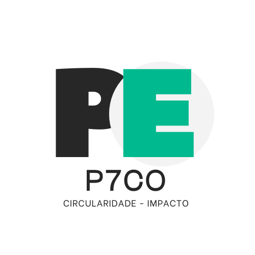

# P7CO® EcoResupply ARTICLES, BLOG and UI

Content repository for sustainability, circular economy and innovation articles

[](https://github.com/jtlivio/P7CO/actions/workflows/content-lint.yml)       

**P7CO® EcoResupply Blog**  
Official blog content repository managed by **pH7x Systems®**.

<p align="center">
  
</p>

## 🌍 About the Project

**Our Mission**  
To promote a real circular economy worldwide by simplifying the reuse of surplus and waste through innovative technology. We connect companies, public entities, and citizens, making material reuse simple, transparent, and measurable.

**Our Vision**  
To become the reference platform for sustainable resource management, inspiring a shift toward a regenerative and collaborative economic model, where every material counts and every contribution creates positive, measurable impact for society and the planet.

**Circularity**  
The future begins with every choice: reuse, share, transform! P7CO® EcoResupply is the international community that connects companies, citizens, and organizations to give new life to surpluses. Here, every action matters. Contribute to a more circular economy, reduce waste, and inspire real change. Join us and be part of a new generation of solutions: smarter, more collaborative, and more sustainable.

## 🗂️ Repository Structure

Rooted at `/static`. All types share the same rules and frontmatter.

* `blog/{pt|en|fr|de|es}/` — Blog posts per language
* `page/{pt|en|fr|de|es}/` — Site pages per language
* `article/{pt|en|fr|de|es}/` — Long-form articles per language
* `ui/{lang}/components/*.json` — JSON files for UI translation (non-application scope)
* `images/` — Images used across posts/pages/articles

**Example:**
```
/static/
  blog/pt/hello-world.md
  page/en/privacy.md
  article/fr/industrial-symbiosis.md
  ui/pt/components/header.json
  images/covers/example.jpg
```

## 🔒 GDPR Compliance (blogs & articles)

- Do **not** include personal data (names, emails, phone numbers, IDs, addresses).  
- **Author information comes from the site profile system**, not from Markdown.  
- Only thematic text, images, and metadata fields are allowed.  
- PRs with personal data in blog posts or articles will be **rejected automatically by CI**.

## 📌 Frontmatter Specification (TOML with `+++`)

All Markdown files (**blog**, **page**, **article**) must start with TOML frontmatter.

### Required fields
- `title` — Main title (plain text, no HTML)
- `intro` — Short introduction (≤ 280 chars)
- `image` — Cover path starting with `/images/` (1200×675 px, ≤ 150 KB, JPEG)
- `date` — Publication date (`YYYY-MM-DD`)
- `tags` — Non-empty array of strings
- `active` — Visibility flag (`true`/`false`)

### Optional / recommended
- `updated_at` — Last updated date (`YYYY-MM-DD`)
- `category` — One of the allowed categories (see below)
- `reading_time` — Estimated minutes to read (integer)
- `lang` — Language code (`pt`, `en`, `fr`, `de`, `es`) — usually inferred from folder
- `slug` — Custom URL slug (defaults to file name)

### Allowed categories
guides, news, case-studies, esg, tech, p7co, policy, community, innovation, circularity, events, na, opinion, analysis, whitepaper, report, insight, legal, environment, market, services, about, faq

### ✅ Example
```toml
+++
title = "Sample Title"
intro = "A short introduction for P7CO EcoResupply."
image = "/images/example.jpg"
date = 2025-04-01
updated_at = 2025-04-02
category = "guides"
tags = ["Sustainability", "Circular Economy"]
reading_time = 5
active = true
+++
```

## 🖼️ Image Requirements

* **Format:** `.jpg` / `.jpeg`
* **Dimensions:** 1200 × 675 px (exact)
* **Max size:** ≤ 150 KB

Pull Requests with non-conforming images will be rejected automatically.

## 🔍 Lint & Validation (CI)

The **Content Lint** workflow validates all Markdown and images under `/static`:

* Frontmatter structure and required fields
* Image format/size/dimensions
* Markdown size (≤ 100 KB) and invalid control characters
* **GDPR compliance check** → ensures no personal data in Markdown frontmatter or body

## 🔐 Branch Protection & CI

* Protected **main** branch
* All changes via **Pull Request**
* **Content Lint** + GDPR compliance must pass before merge
* At least **1 review approval** required

## 🤝 Contributing

This repository is **public but protected** — only the pH7x Systems team can commit directly. Suggestions, corrections, and translations are welcome via **Issues** or **Pull Requests**.

### Contribution Rules

**Markdown content** (`blog/`, `page/`, `article/`)

* Only `.md` files
* **No personal data (GDPR rule)**
* Max file size: **100 KB**
* Mandatory frontmatter: `title`, `intro`, `image`, `date`, `tags`, `active`

**UI** (`ui/{lang}`)

* Only `.json` files
* Flat key-value structure
* No HTML or JavaScript in values
* Must validate as strict JSON (`jq . file.json`)

Please read our **Contributing Guide** and follow our **Code of Conduct**.

## 📜 License

[](LICENSE-arti.md) [](LICENSE-content.md)

* **Source code (scripts, helpers):** [GNU GPL v3.0](LICENSE-arti.md)
* **Content (articles, images, markdown):** [CC BY-SA 4.0](LICENSE-content.md)

## 💚 Support this Project

You can support **P7CO® EcoResupply** via:

* Patreon: [https://www.patreon.com/p7co](https://www.patreon.com/p7co)

## 📖 Citation

If you use this project, please cite it using one of the formats below:

- [APA](./CITATION.apa.txt)
- [BibTeX](./CITATION.bib)

Or use the GitHub “Cite this repository” button powered by [CITATION.cff](./CITATION.cff).

## 📬 Contact

For questions, suggestions, or partnerships:

* 🌐 [https://p7co.org](https://p7co.org)
* 📩 [hello@p7co.org](mailto:hello@p7co.org)