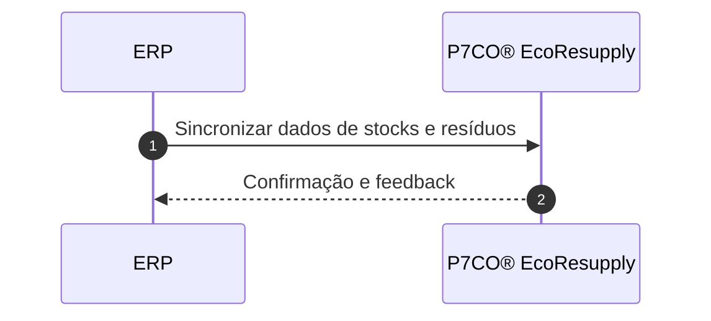
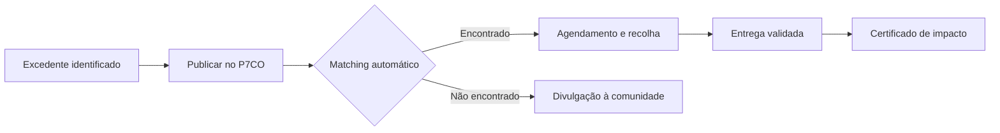
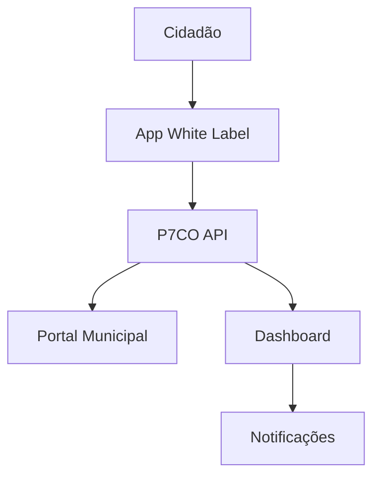
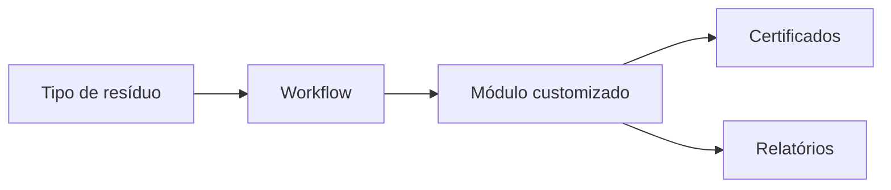
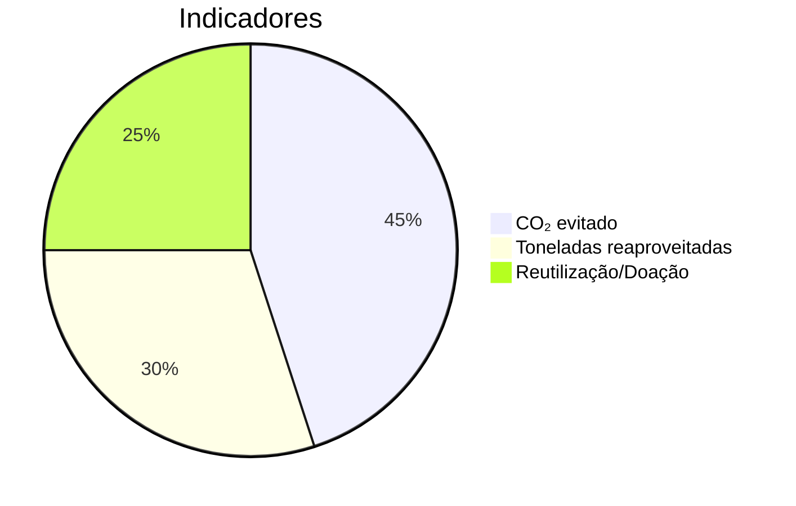
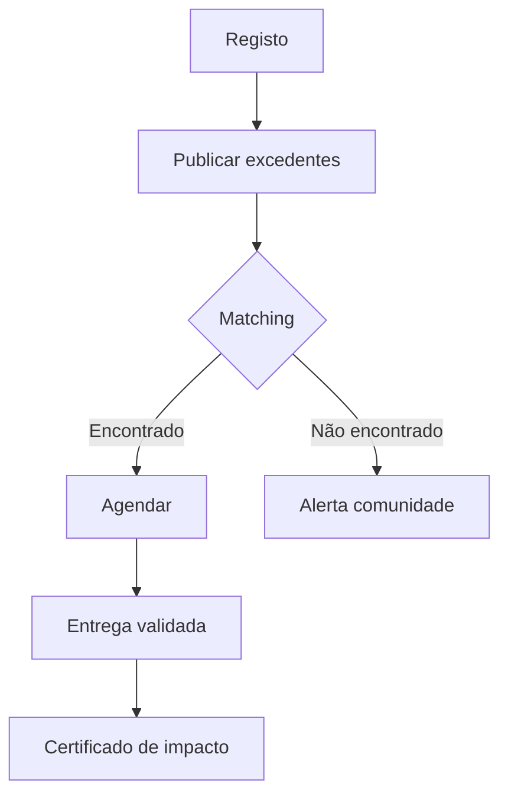

+++
title = "O que oferecemos a empresas, municípios e parceiros"
intro = "Soluções integradas, modulares e inovadoras para uma economia circular conectada, com impacto real no ambiente e nos resultados."
image = "/images/p7co.png"
date = 2025-09-01
tags = ["Serviços", "Economia Circular", "Parcerias", "ERP", "ESG"]
active = true
+++

Soluções integradas, modulares e inovadoras para uma economia circular conectada, com impacto real no ambiente e nos resultados das organizações.  
Tudo desenvolvido e adaptado para responder às necessidades de cada parceiro — em qualquer parte do mundo.

## Integração Bidirecional ERP
Ligamos o P7CO® EcoResupply ao seu ERP (ou ao parceiro já existente), permitindo trocas automáticas de dados de stocks, resíduos e operações — tudo **sem fricção e com segurança**.  
Suportamos **SAP, Oracle, Microsoft Dynamics, Primavera, PHC, Navision** e integrações customizadas.

## Reciclagem & Excedentes
Integração facilitada para empresas de reciclagem e produtores de resíduos: **gestão de excedentes com códigos normalizados**, processos de reporte digital e módulos personalizados para **automação ambiental**.  
Fluxos otimizados para **reutilização, doação e valorização** em escala global.

## Municípios & Integração API
Acesso das autoridades locais a **denúncias ambientais em tempo real** via API, integração direta com portais institucionais e **App White Label** para envolvimento do cidadão.  
Dashboards e notificações totalmente configuráveis.

## Sistemas de Reciclagem Customizados
Desenvolvimento de módulos de reciclagem e reporting ajustados a cada cliente ou parceiro, com workflows para diferentes tipos de resíduos, integração logística, **certificados** e **relatórios automáticos**.

## Certificação e Relatórios ESG
Geração automática de relatórios de sustentabilidade, **certificação de impacto**, métricas ESG e documentação pronta para **reporting anual, compliance global e candidaturas a incentivos ambientais**.

## Suporte e Parcerias Customizadas
Consultoria especializada, integração com parceiros logísticos, IT e ambientais, **formação para equipas**, acompanhamento técnico próximo e **suporte total** em todas as fases do projeto.

# Como funciona o P7CO® EcoResupply?
Simples, digital e feito para circularidade real. Saiba como tudo acontece, do registo ao impacto!

1. **Publicar Excedentes**  
   Adicione rapidamente excedentes, materiais ou equipamentos, com descrição, fotos e localização — prontos para reutilização.

2. **Encontrar Interessados**  
   O sistema faz **match automático** e sugere empresas, ONGs ou entidades que procuram os seus excedentes.

3. **Agendar & Valorizar**  
   Agende a recolha, confirme a entrega e receba o **comprovativo de impacto ambiental** direto na sua área pessoal.

# Funcionalidades que fazem a diferença
Tudo o que precisa para transformar excedentes em impacto positivo — para si, para a sua empresa e para o planeta.

## Gestão Circular
Publicação rápida de excedentes, equipamentos e materiais — prontos para **reutilização, troca ou doação**.

## Indicadores & Relatórios
Métricas automáticas de **CO₂ evitado**, **toneladas reaproveitadas** e **relatórios ESG** prontos para reporting.

## Match Inteligente
Sistema de **match** que liga quem oferece a quem procura, garantindo **circularidade** e **colaboração real**.

## Logística Simplificada
Integração com transportadoras e operadores para **recolhas, entregas** e **processos certificados**.

## Colaboração Aberta
Comunidade de empresas, municípios e ONGs para **partilha**, **inovação** e **reporting conjunto**.

## Certificação de Impacto
**Comprovativo automático** para ESG, candidaturas, auditorias e comunicação institucional.

# Missão & Visão
O que nos move. Onde queremos chegar.

## A Nossa Missão
Promover uma **economia circular real** a nível global, simplificando o reaproveitamento de excedentes e resíduos através de **tecnologia inovadora**.  
Ligamos empresas, entidades públicas e cidadãos em diferentes geografias, tornando a **reutilização** de materiais simples, transparente e **mensurável**.

## A Nossa Visão
Ser a **plataforma de referência internacional** na gestão sustentável de recursos, inspirando a mudança para um **modelo económico regenerativo** e colaborativo — onde **cada material conta** e cada contributo gera **impacto positivo** e mensurável para a sociedade e o planeta.
